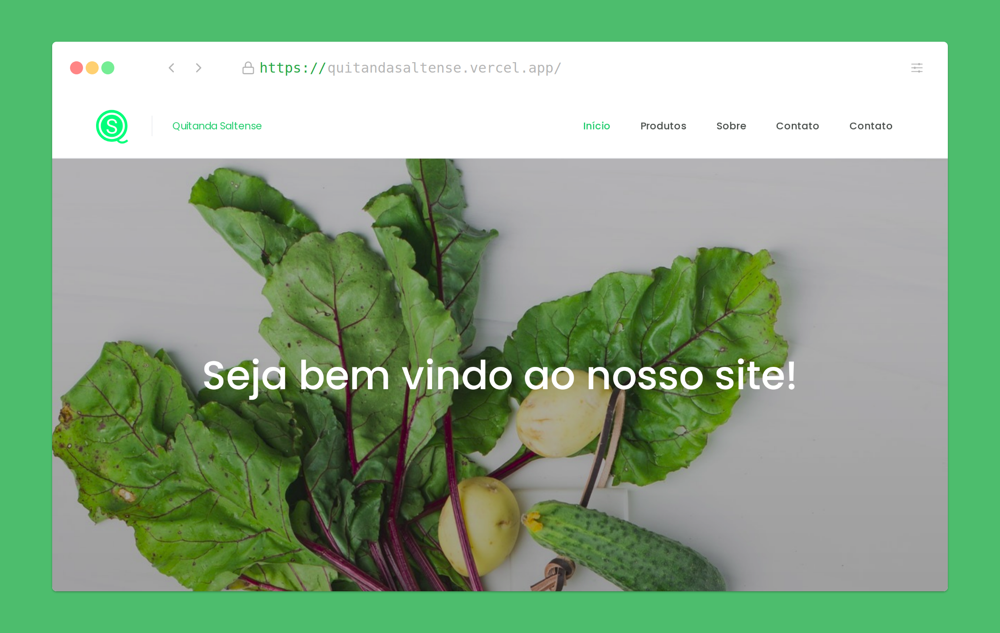

# Quitanda Saltense website

> An Eccommerce website develop with nextjs to a IFSP project

This project aims to solve a problem of a green grocery store that, with the advent of COVID-19, saw the sales drop and decide to sell its products online



## :construction_worker: Get started

**Clone this project to your computer:**

```
git clone https://github.com/cunhaedu/quitandasaltense.git
```

Then, run the following code in order to got the application running in localhost:3000

```bash
npm run dev
# or
yarn dev
```

## :rocket:  Technologies

* [Next.js](https://nextjs.org/)
* [Sass](https://sass-lang.com/documentation/syntax)
* [Typescript](https://www.typescriptlang.org/)
